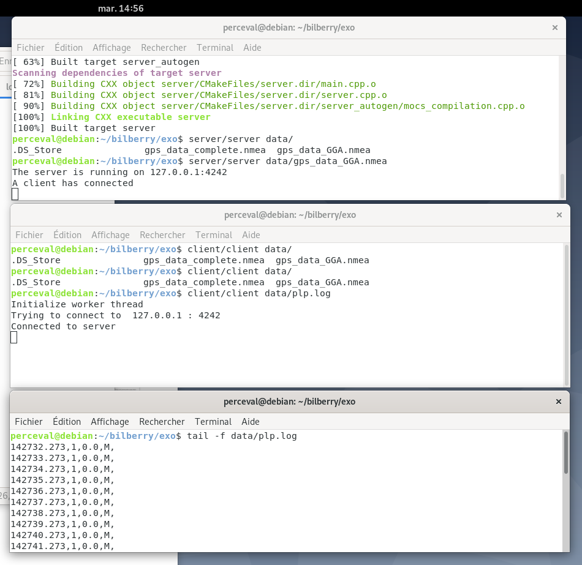

# GPS Client / Server pour Bilberry

Exercice d'entrée à [Bilberry](https://bilberry.io)

Le but est d'implémenter un système en deux modules : le module GPS et le client GPS.
Ces deux modules sont représentés par :
 * un serveur socket TCP qui envoie toutes les secondes la trame NMEA ;
 * un client TCP qui se connecte au serveur GPS pour récupérer la trame et extrait 
 les informations Qualité GPS et d'altitude ;
 * un thread qui s’occupe de loguer dans un fichier avec un timestamp les 
 données reçues par le client.

Les contraintes sont les suivantes : 
 * Utiliser en C++11 ou supérieur ;
 * Utiliser des QtcpSockets ;
 * Utiliser CMake ; 
 * Le programme doit fonctionner sous linux.

## Compilation

### Linux (Debian)
```bash
sudo apt install build-essential qt5-default
cd bilberry_test
cmake .
cmake --build .
```

### macos
```bash
brew install qt@5
brew link qt@5
export PATH="/usr/local/opt/qt@5/bin:$PATH"
cd bilberry_test
cmake .
cmake --build .
```

### Execution
Executez ces deux commandes dans deux terminaux différents :
```bash
server/server data/gps_data_GGA.nmea
client/client data/record.log
```

## Trame GPS NMEA
Un GPS émet une trame appelée NMEA GGA qui contient une information de position. Voici un exemple :
```
$GPGGA,123519,4807.038,N,01131.324,E,1,08,0.9,545.4,M,46.9,M, , *42
```

La correspondance des champs est la suivante :
```
123519 = Acquisition du FIX à 12:35:19 UTC
4807.038,N = Latitude 48 deg 07.038' N
01131.324,E = Longitude 11 deg 31.324' E
1 = Fix qualification : (0 = non valide, 1 = Fix GPS, 2 = Fix DGPS)
08 = Nombre de satellites en poursuite
0.9 = DOP (Horizontal dilution of position) Dilution horizontale
545.4,M = Altitude, en Mètres, au dessus du MSL (mean see level) niveau moyen des Océans
46.9,M = Correction de la hauteur de la géoïde en Mètres par rapport à l'ellipsoïde WGS84 (MSL)
(Champ vide) = nombre de secondes écoulées depuis la dernière mise à jour DGPS.
(Champ vide) = Identification de la station DGPS.
*42 = Checksum
```

Les champs qui nous intéressent sont :
 * La date d'acquisition (timestamp) (2)
 * La qualité GPS (Fix Quality) (7)
 * L'altitude (10 et 11)

### Source des données


## Choix techniques
 * La bibliothèque QT a entièrement été utilisée pour l'exercice : les programmes ont été implémentés sous la forme de ```QApplication``` car l'exercice nécessite l'utilisation de ```QTcpSocket``` ;
 * Le serveur lit un fichier contenant les trames NMEA pour simuler la présence d'une vraie source de données ;
 * Le fichier source ne contient que des trames GPGGA,  on pourra y ajouter d'autres types de trame et les  filtrer lors de leur réception par le client ;
 * Le serveur et le client prennent en argument respectivement le nom du fichier source et du fichier destination, ce qui ne serait pas forcément le cas si le code était intégré dans un plus gros projet ;
 * Le numéro du port est fixé grâce à des ```#define``` dans le serveur et le client. On pourra inclure un ```constants.h``` dans le client et le serveur, contenant un ```#define``` unique dans les deux fichiers ;
 * On pourra également utiliser des ```QDataStram``` pour l'envoie des données ;
 * Le timestamp est enregistré tel quel dans le fichier, il pourra être enregistré au format Unix grâce à la classe ```QDateTime```.

## Preuve de fonctionnement


